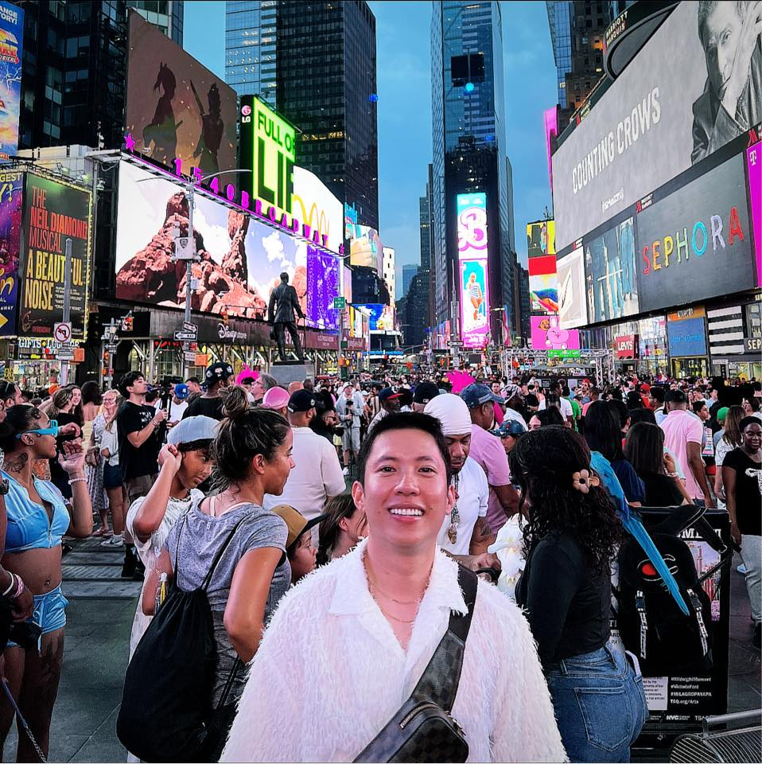

|[Visualizing Government Debt-to-GDP Ratio](DataVisualizationPortfolioHW.md) | [News Organization Trust Survey](TrustinNewsOrganizations.md) | [Final Project I](final_project_PartI_EnzoRodriguez.md) | [Final Project II](final-project-part-two_EnzoRodriguez.md) | [Final Project III](final-project-part-three-EnzoRodriguez.md) |
|   :---:   |   :---:   |   :---:   |   :---:   |   :---:   |

# Portfolio
This fall 2023, I am taking the course *Telling Stories with Data* at the Carnegie Mellon University. Here you can preview my portfolio designs as I learn and explore more with data visualization contingent to the tools available to me. I cannot wait to take you with me in this journey!

# About me
 

Mabuhay!  My name is **Kent Laurence** but my preferred name is **Enzo**. I am an international merit scholar from the Philippines studying Master's of Science, Public Policy and Management with Digital Transformation and Analytics concentration. My interest in data visualization stemmed from the nascent utilization in my home country, this made me want to further my knowledge/expertise so that I am able to interpret data in a meaningful and easily digestible manner.

Fan facts about me, I used to be a mountain climber, but since I have no time to do this here in the U.S., I shifted my interest into working out five times a week. I am also a fur parent to two adorable and energetic beagles. 

 

# What I hope to learn
I wish to learn the effective and appropriate visualization techniques that will encompass colour hue selection and aesthetically pleasing layout, inter alia, consequently understanding how it will colleasce with the data narrative to be better appreciated by the audience.

# Portfolio

## Homework 2: [Visualizing Government Debt-to-GDP Ratio](DataVisualizationPortfolioHW.md)
This page shows my work on homework 2 that is comprised of three parts. Part 1 is the data visualization on the comparison of the government debt-to-GDP ratio of select countries for 2018 to 2022. Part 2 is the data visualization on the government debt-to-GDP of select countries from 1996 to 2020 following the sparklines design. And Part 3 is my personal data visualization design of the top 5 countries with the highest government debt-to-GDP ratio from 2007 to 2021.

## Homeworks 3&4: [Human Rights Index](HumanRightsIndexHW34.md)
This data visualization homework particularly looks at a publicly available visualization with the end goal of redesigning it based on critiques gathered from contemporaries at the university. The process involved five distinct steps, these are as follows:

*Step 1:* Finding a publicly available data visualization

*Step 2:* Critiquing the data visualization using Stephen Few's Data Visualization Effectiveness Profile

*Step 3:* Sketching of the prospective redesign

*Step 4:* Testing out the solution through sharing them to contemporaries for feedback

*Step 5:* Creating a solution based on all the gathered feedback

I have detailed my experience on this homework in the provided link for this section.

## Lab Exercise 1: [News Organization Trust Survey](TrustinNewsOrganizations.md)
Using the tableau application, we were able to replicate the data visualization on News Organization Trust Survey. This is our introductory to tableau, which we were able to utilize some techniques and navigate the application's settings for a good visualization.

## Final project: 
For my final project, I want to dive into the Financial Inclusion space. I want to inform the audience of the importance of this advocacy specifically the impact it has on the socioeconomic status of a population. The main focus is the Philippines which will be compared with its neighboring countries. Ultimately, nudging the audience to have financial access and promote this advocacy to their families and friends.

[Final Project I](final_project_PartI_EnzoRodriguez.md) 
For this part of my final project, I introduced my topic Financial Inclusion. I provided the abstract that became the backdrop of my final data story. I explicitly mentioned the sections that I envisioned my data story will look like, which was a good decision since doing the subsequent parts is made easy since I already know what I want to say and how I will say it.

Here I made my initial sketches based on the raw data that I gathered from my references. I was not yet cognizant of the entire picture of my visualizations, hence, I doodle varied designs just to capture what my data would possibly look like. This is my way of guiding myself in the next steps of the design process. 

I explicitly mentioned the data sources, that bulk of my data story will be sourced from. I provided explanation as to the relevance of these sources to my data story so that I will be able to align my subsequent write-ups/designs properly.

[Final Project II](final-project-part-two_EnzoRodriguez.md)
Now that I conceptually have my story board, for this part of my final project, I focused on the target audience. I discussed what I envision my target audience to be, and provided explanation on the reasons I chose these groups. 

As part of this exercise, I got the chance to interview four people that I believed would be able to provide me valuable comments/inputs to my draft data story. I discussed why I selected them to be my interviewee, specifically their relevance to the data presented. I shared my interviewee script including the goals/rationale for each question.

I then presented my interview findings, which consisted of the responses of the interviewees and highlighted those areas that they believed would be a good addition and gave emphasis on their suggestions that would make the data story better. Since they were only able to see the rough draft of the story, any comments raised were very much valuable given my goal for this presentation.

Lastly, I synthesized the findings in such a way that would make sense to me. Here, I filtered those comments and suggestions that would be an addedndum to the final data story and explained how these will be implemented in the final design.

[Final Project III](final-project-part-three-EnzoRodriguez.md)
For the final leg of my project, I decided to embed my shorthand presentation for convenience of the reader. I discussed my final changes to the data story vis-a-vis the draft presentation in part II. I emphasized here where the changes originated, which were the synthesized version of the interview findings, in-class critiquing, and comments from Professor Goranson.

Following the above, I discussed my final write-up on my target audience, which I decided to revise based on the comments and my final story board. I included my thought process for the revision and what I hope the final audience would get from this presentation.
